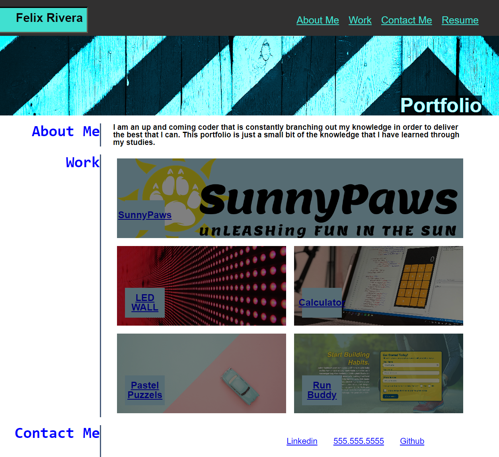

# <Portfolio Website>

## Description
This website was created to help display information of myself and the knowledge that I have accumulated throught the course so far. This shows the basic understanding of code in order to deliever a use-friendly website. The code was arranged in order of what is presented on the page to help follow what was changed and added to the user interface.

## Usage

